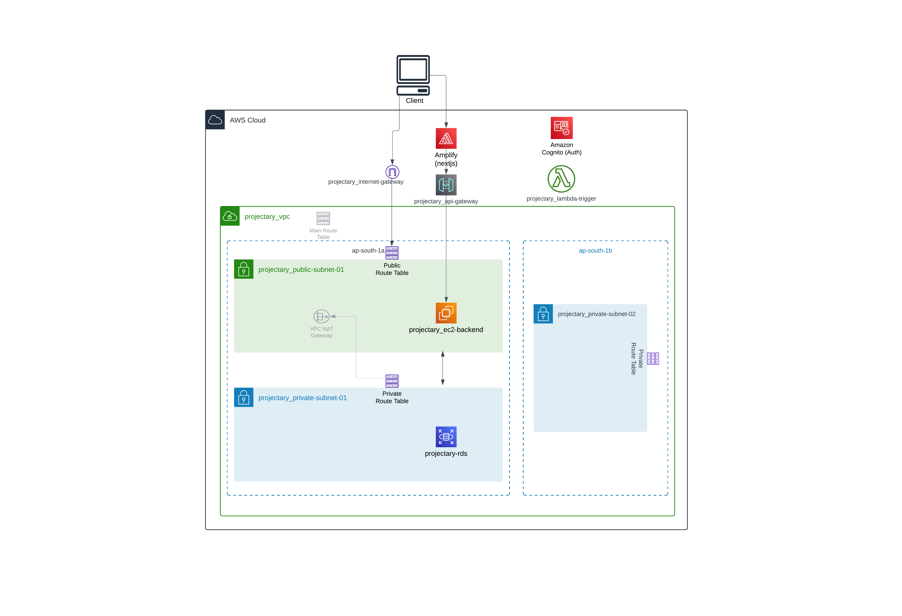
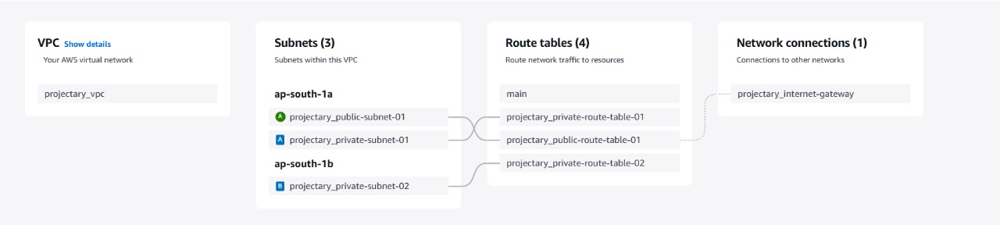

# projectary

A project management application built with Next.js, TypeScript, and Node.js. Uses RTK queries for sending requests from the client. Uses cognito auth, with frontend deployed on Amplify and backend on Amazon ec2.

## 📁 Directory Structure

```
└── shivd131-projectary/
    ├── README.md
    ├── client/
    │   ├── src/
    │   │   ├── app/
    │   │   ├── lib/
    │   │   └── state/
    └── server/
        ├── prisma/
        └── src/
            ├── controllers/
            └── routes/
```

[Full directory structure at the bottom]

## ✨ Features

- **Multiple Project Views**: Board, List, Table, and Timeline views
- **Priority Management**: Organize tasks by priority (Urgent, High, Medium, Low, Backlog)
- **Team Collaboration**: Manage teams and assign tasks to team members
- **Real-time Search**: Quick access to projects, tasks, and team members
- **Timeline View**: Visualize project progress and deadlines
- **Customizable Dashboard**: Personalized view of your projects and tasks

## 🚀 Prerequisites

- Node.js (v18 or higher)
- npm or yarn
- MySQL

## 💻 Installation

1. Clone the repository:
```bash
git clone https://github.com/Shivd131/projectary.git
cd projectary
```

2. Install dependencies for both client and server:
```bash
# Install client dependencies
cd client
npm install

# Install server dependencies
cd ../server
npm install
```


3. Set up the database:
```bash
cd server
npx prisma generate
npx prisma migrate dev
npx prisma db seed
```

## 🏃‍♂️ Running the Application

1. Start the server:
```bash
cd server
npm run dev
```

2. Start the client (in a new terminal):
```bash
cd client
npm run dev
```

The application will be available at:
- Frontend: http://localhost:{PROVIDED_PORT}
- Backend: http://localhost:{PROVIDED_PORT}

## 🛠️ Technologies Used

### Frontend
- Next.js 14
- TypeScript
- Redux Toolkit
- Tailwind CSS
- Shadcn UI

### Backend
- Node.js
- Express
- Prisma
- PostgreSQL
- TypeScript

### AWS Cloud Infrastructure
- **Amazon RDS**: MySQL database instance
- **Amazon EC2**: Hosts the Node.js backend server
- **AWS Amplify**: Manages frontend deployment and hosting with CI/CD
- **Amazon Cognito**: Handles user authentication and authorization
- **Amazon VPC**: Provides isolated network infrastructure
- **Amazon API Gateway**: Manages API endpoints and request routing
- **AWS Lambda**: serverless functions cognito

### AWS DIAGRAM


### VPC RESOURCE MAP


## 🔄 API Endpoints

- `/api/projects` - Project management
- `/api/tasks` - Task management
- `/api/users` - User management
- `/api/teams` - Team management
- `/api/search` - Search functionality

## 🤝 Contributing(The UI might have some "features"—aka bugs. Feel free to tame them :))

1. Fork the repository
2. Create your feature branch (`git checkout -b feature/amazing-feature`)
3. Commit your changes (`git commit -m 'Add some amazing feature'`)
4. Push to the branch (`git push origin feature/amazing-feature`)
5. Open a Pull Request


## 📂 Complete Directory Structure

```
└── shivd131-projectary/
    ├── README.md
    ├── client/
    │   ├── README.md
    │   ├── eslint.config.mjs
    │   ├── next-env.d.ts
    │   ├── next.config.mjs
    │   ├── package-lock.json
    │   ├── package.json
    │   ├── postcss.config.mjs
    │   ├── tailwind.config.ts
    │   ├── tsconfig.json
    │   ├── .env.local
    │   ├── .prettierrc
    │   ├── public/
    │   └── src/
    │       ├── app/
    │       │   ├── authProvider.tsx
    │       │   ├── dashboardWrapper.tsx
    │       │   ├── globals.css
    │       │   ├── layout.tsx
    │       │   ├── page.tsx
    │       │   ├── redux.tsx
    │       │   ├── (components)/
    │       │   ├── home/
    │       │   ├── priority/
    │       │   ├── projects/
    │       │   ├── search/
    │       │   ├── settings/
    │       │   ├── teams/
    │       │   ├── timeline/
    │       │   └── users/
    │       ├── lib/
    │       │   └── utils.ts
    │       └── state/
    │           ├── api.ts
    │           └── index.ts
    └── server/
        ├── ecosystem.config.js
        ├── package-lock.json
        ├── package.json
        ├── tsconfig.json
        ├── dist/
        ├── prisma/
        │   ├── schema.prisma
        │   ├── seed.ts
        │   ├── migrations/
        │   └── seedData/
        └── src/
            ├── index.ts
            ├── controllers/
            └── routes/
```
